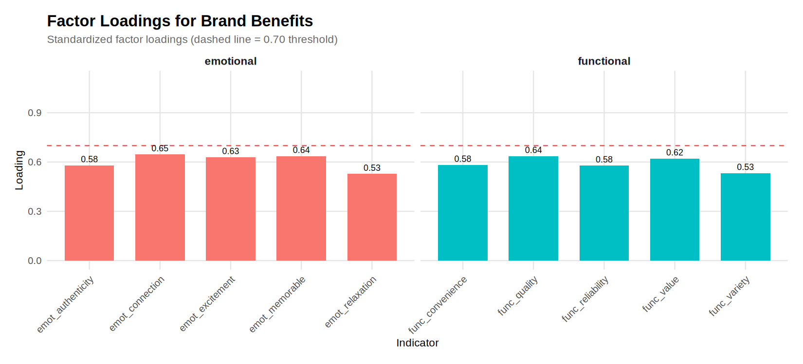
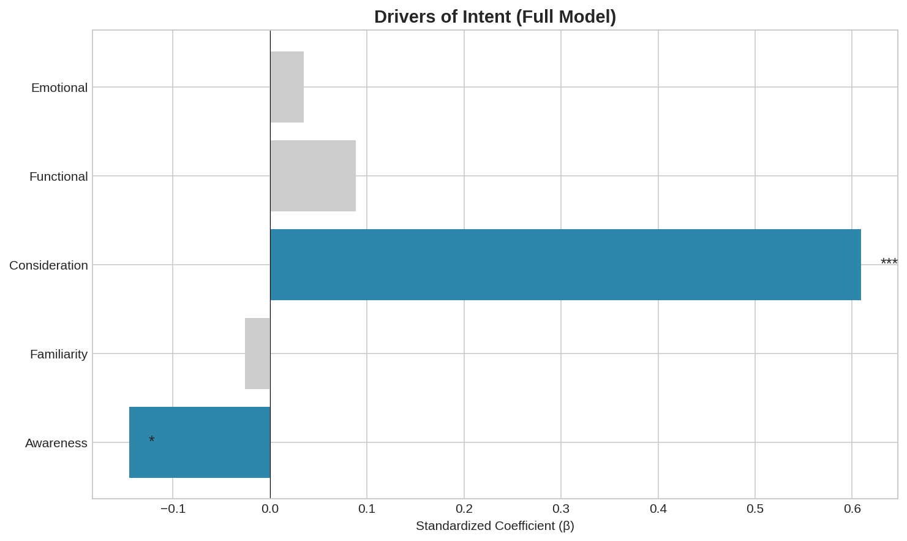
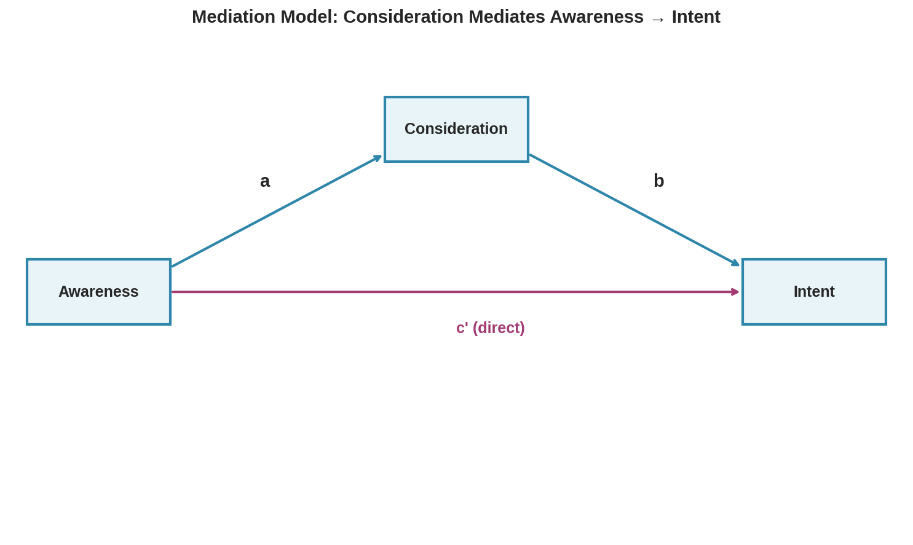
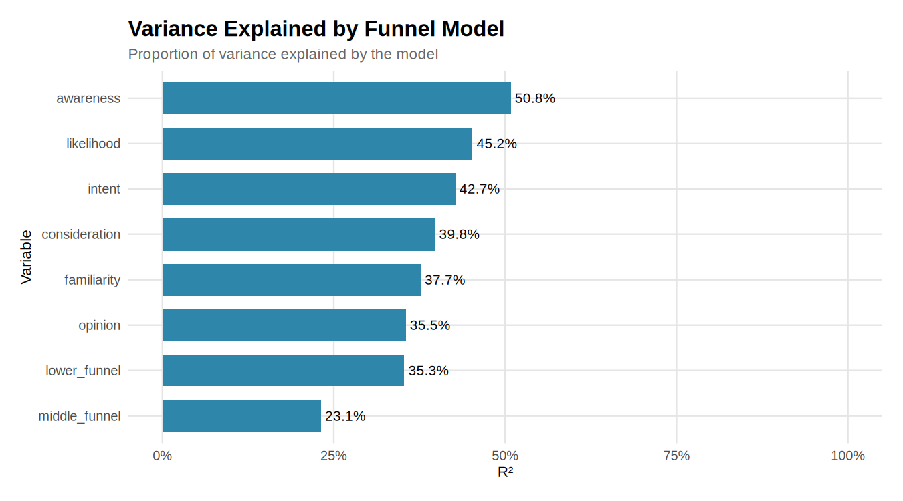
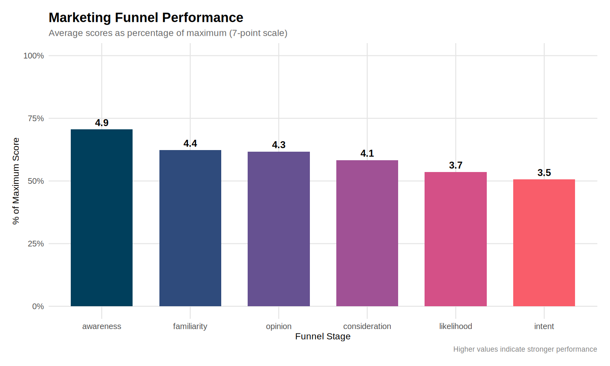
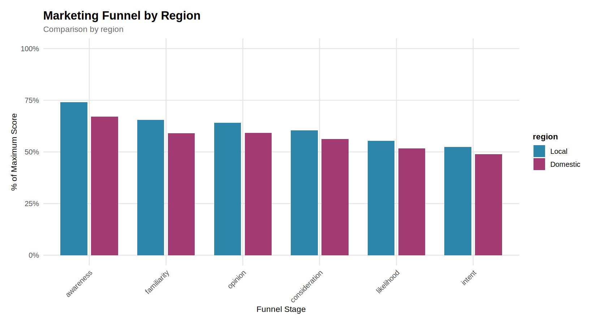
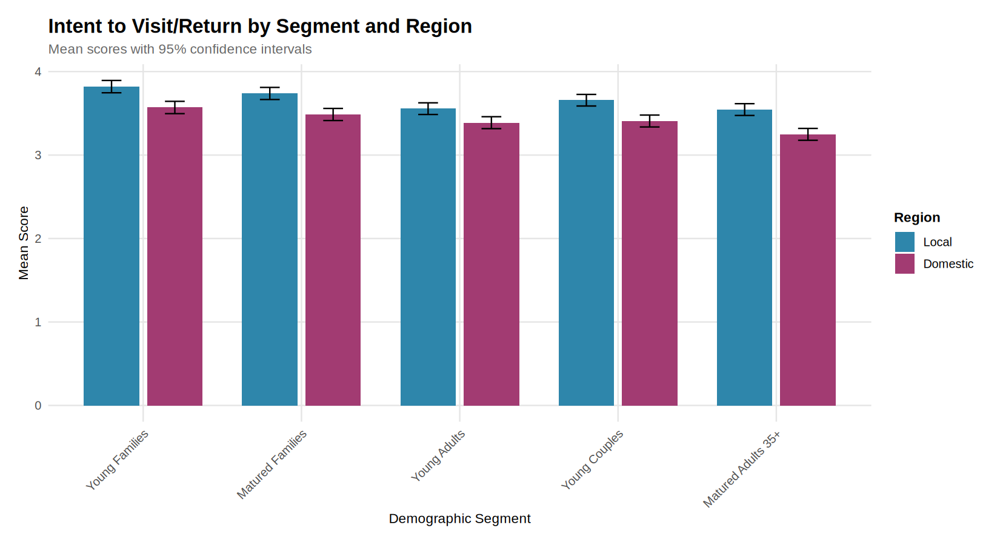
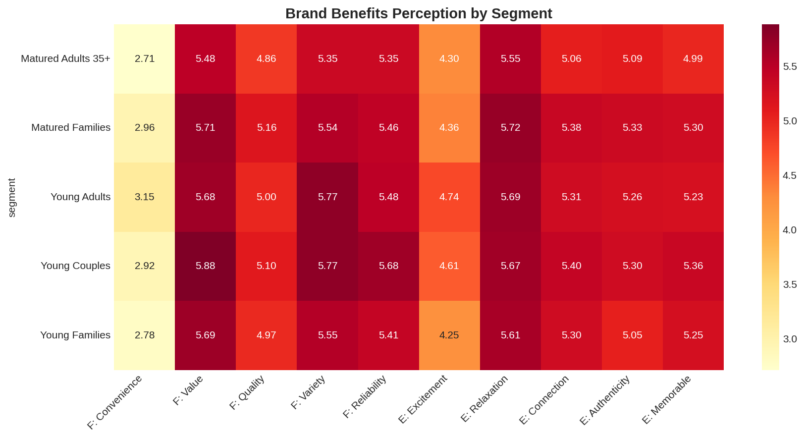
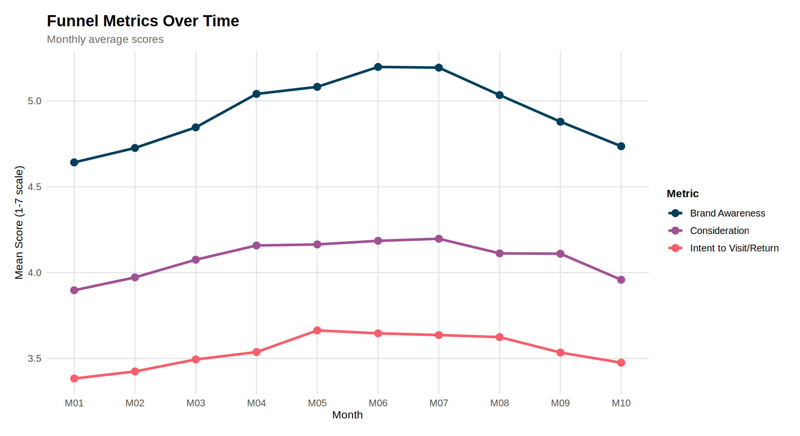
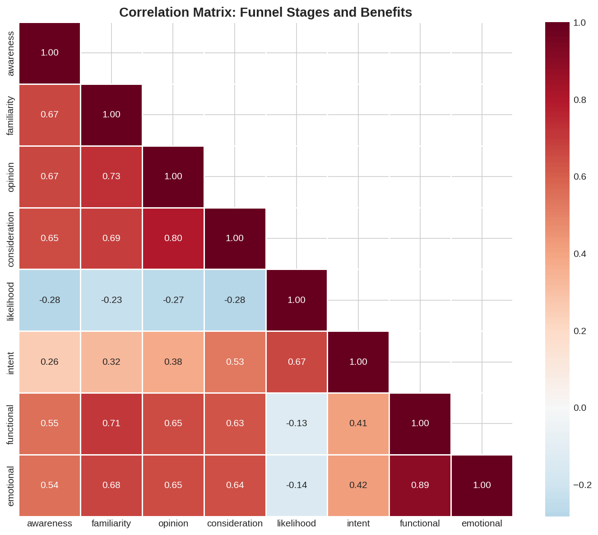

# Japan Market Analysis - SEM and Marketing Funnel Study

A comprehensive analytical framework for analyzing Japan theme park market survey data using **Structural Equation Modeling (SEM)** and marketing funnel analysis.

---

## 🆕 Real Data Analysis (TDL Focus)

**For the latest analysis using actual survey data, see: [`README_TDL_ANALYSIS.md`](README_TDL_ANALYSIS.md)**

This analysis uses the validated **Relabeled Raw Data.csv** with correct Likert scale mappings:
- **Sample:** 541 respondents  
- **Focus:** Tokyo Disneyland (TDL)
- **Scale Validation:** All scales confirmed (5=High/Positive, 1=Low/Negative)

**Key Findings:**
- Overall Likelihood to Visit: **3.90** (scale 1-5)
- Top Segment: **Couples 18-34** (Likelihood: 4.22)
- Biggest Weaknesses: **Not Crowded (2.01)**, **Affordable (2.12)**
- Top Emotional Driver: **Land of Dreams (4.41)**

Run the analysis:
```bash
cd japan_market_analysis
python3 src/analyze_tdl_data.py
```

---

## 📊 Project Overview (Framework)

### Research Objectives

1. **Marketing Funnel Analysis**: Understand how funnel KPIs (awareness → familiarity → opinion → consideration → likelihood → intent) drive intent to visit/return
2. **Brand Benefits Analysis**: Analyze how functional and emotional brand perceptions influence intent
3. **Segment Comparison**: Compare marketing effectiveness across demographic segments and regions
4. **Mediation Testing**: Test indirect effects within the funnel

### Sample Structure

- **Total Sample**: n=10,000 (n=1,000/month × 10 months)
- **Regions**: 
  - **Local**: Greater Tokyo + 7 major prefectures (higher brand exposure)
  - **Domestic**: All other prefectures
- **Demographic Segments** (100 per group per region per month):
  - Young Families (child < 6)
  - Matured Families (child 7-17)
  - Young Adults (18-34, single)
  - Young Couples (18-34, partnered, no kids)
  - Matured Adults 35+ (no kids)

---

## 🔬 Understanding Structural Equation Modeling (SEM)

### What is SEM?

**Structural Equation Modeling (SEM)** is a powerful multivariate statistical technique that combines:
- **Factor Analysis**: Identifies latent (unobserved) constructs from measured variables
- **Path Analysis**: Tests causal relationships between variables

SEM allows us to answer questions like:
- *"Does brand awareness lead to purchase intent?"*
- *"Do emotional benefits have a stronger effect on intent than functional benefits?"*
- *"Is the effect of awareness on intent mediated by consideration?"*

### Key SEM Concepts

#### 1. Latent Variables vs. Observed Variables

| Type | Description | Example |
|------|-------------|---------|
| **Observed** | Directly measured from survey | "How aware are you of this brand?" (1-7 scale) |
| **Latent** | Unobserved construct inferred from multiple indicators | "Upper Funnel" (measured by awareness + familiarity) |

#### 2. Measurement Model (CFA)

The **Confirmatory Factor Analysis (CFA)** tests whether observed variables adequately measure latent constructs.

```
Functional Benefits =~ convenience + value + quality + variety + reliability
Emotional Benefits =~ excitement + relaxation + connection + authenticity + memorable
```

**Factor Loadings** indicate how strongly each indicator reflects the latent construct:
- **> 0.7**: Excellent
- **0.5 - 0.7**: Acceptable
- **< 0.5**: Poor (consider removing)



#### 3. Structural Model (Path Analysis)

The structural model tests **causal paths** between variables:

```
Middle Funnel ~ Upper Funnel          # Awareness/familiarity → Opinion/consideration
Lower Funnel ~ Middle Funnel + Upper Funnel   # Both direct and indirect paths to intent
```

**Path Coefficients (β)** indicate effect strength:
- **β > 0.5**: Large effect
- **0.3 < β < 0.5**: Medium effect
- **0.1 < β < 0.3**: Small effect
- **β < 0.1**: Negligible effect



#### 4. Direct vs. Indirect Effects

**Concept Overview:**

| Effect Type | Description | How to Calculate |
|-------------|-------------|------------------|
| **Direct** | X directly influences Y (controlling for mediator) | Path coefficient X → Y |
| **Indirect** | X influences Y through mediator M | Product of paths: (X → M) × (M → Y) |
| **Total** | Complete effect of X on Y | Direct + Indirect |

**Actual Mediation Results: Does Consideration Mediate the Effect of Funnel Stages on Intent?**

We tested whether consideration mediates the relationship between earlier funnel stages and intent. Here are the actual results:

**Direct Effects on Intent (controlling for consideration):**

| Predictor | Direct β | SE | p-value | Significance |
|-----------|----------|-----|---------|--------------|
| Likelihood | 0.377 | 0.009 | < 0.001 | *** |
| Awareness | 0.077 | 0.010 | < 0.001 | *** |
| Opinion | 0.068 | 0.010 | < 0.001 | *** |
| Familiarity | 0.059 | 0.010 | < 0.001 | *** |

**Indirect Effects via Consideration:**

| Predictor | Indirect β | SE | p-value | % Mediated |
|-----------|------------|-----|---------|------------|
| Opinion → Consideration → Intent | 0.030 | 0.003 | < 0.001 | **30.6%** |
| Awareness → Consideration → Intent | 0.010 | 0.001 | < 0.001 | 11.6% |
| Familiarity → Consideration → Intent | 0.006 | 0.001 | < 0.001 | 9.9% |

**Total Effects on Intent:**

| Predictor | Total β | Interpretation |
|-----------|---------|----------------|
| Opinion | 0.098 | Strongest upper-funnel predictor |
| Awareness | 0.087 | Second strongest |
| Familiarity | 0.065 | Moderate effect |



**Key Findings:**

1. **Partial Mediation Confirmed**: All direct effects remain significant after adding consideration, indicating **partial mediation** (not full mediation).

2. **Opinion Shows Strongest Mediation**: 30.6% of opinion's effect on intent is mediated through consideration. 
   > *"Favorable opinion significantly influences intent both directly (β = 0.068, p < 0.001) and indirectly through consideration (indirect β = 0.030, p < 0.001), with consideration mediating 31% of the total effect."*

3. **Likelihood is the Strongest Direct Driver**: With β = 0.377, likelihood has the strongest direct effect on intent, which makes sense as these are adjacent funnel stages.

4. **Model Fit**: 
   - Intent R² = 0.222 (22% of variance explained)
   - Consideration R² = 0.166 (17% of variance explained)

**Mediation Interpretation Guide:**
- **Full mediation**: Direct effect becomes non-significant when mediator is added
- **Partial mediation**: Direct effect remains significant but is reduced (✓ our case)
- **No mediation**: Indirect effect is not significant

**Strategic Implication:**
> Building favorable **opinion** is the most effective upper-funnel strategy because it has both strong direct effects on intent AND substantial indirect effects through consideration. Marketing efforts should focus on shaping positive brand perceptions, which will naturally drive consumers into the consideration set.

#### 5. Model Fit Indices

| Index | Excellent | Acceptable | Interpretation |
|-------|-----------|------------|----------------|
| **CFI** | ≥ 0.95 | ≥ 0.90 | Comparative Fit Index - compares model to null model |
| **TLI** | ≥ 0.95 | ≥ 0.90 | Tucker-Lewis Index - adjusts for model complexity |
| **RMSEA** | ≤ 0.06 | ≤ 0.08 | Root Mean Square Error of Approximation - badness of fit |
| **SRMR** | ≤ 0.08 | ≤ 0.10 | Standardized Root Mean Residual |

**Example interpretation:**
> *"The model demonstrated excellent fit (CFI = 0.99, RMSEA = 0.03, SRMR = 0.02), indicating the hypothesized relationships are consistent with the observed data."*

#### 6. R² (Variance Explained)

R² indicates how much variance in an outcome is explained by its predictors:



**Example interpretation:**
> *"The model explained 43% of variance in intent (R² = 0.43), with consideration being the strongest predictor."*

---

## 📈 Key Results

### Marketing Funnel Performance

The funnel shows progressive engagement from awareness through intent:



**Key insight:** There's a notable drop-off between consideration and likelihood, suggesting this is a critical conversion point to optimize.

### Regional Comparison

Local (metro) respondents show higher scores across all funnel stages:



**Key insight:** The Local region outperforms Domestic across all metrics, likely due to higher brand exposure and accessibility.

### Drivers of Intent

The SEM analysis reveals the key drivers of intent to visit:

| Predictor | β | p-value | Interpretation |
|-----------|---|---------|----------------|
| Consideration | 0.172 | < 0.001 | Strongest driver - being in the consideration set is critical |
| Awareness | 0.136 | < 0.001 | Direct awareness effects remain significant |
| Familiarity | 0.104 | < 0.001 | Deeper brand knowledge drives intent |
| Emotional Benefits | 0.029 | 0.027 | Emotional connection has modest but significant effect |
| Functional Benefits | 0.016 | 0.248 | Not significant - functional aspects are table stakes |

**Strategic Implication:** Focus on moving consumers from awareness into the consideration set, while building emotional connections with the brand.

### Segment Analysis

Intent varies significantly across demographic segments:



**Key insights:**
- **Young Families** show highest intent in both regions
- **Young Adults** show lowest intent - opportunity for targeted campaigns
- Local region consistently outperforms Domestic across all segments

### Brand Benefits Perception

Heatmap of benefit perceptions across segments:



### Time Trends

Monthly trends in key funnel metrics:



### Correlation Structure

The correlation matrix confirms the expected funnel progression:



**Key insight:** Adjacent funnel stages show stronger correlations (e.g., awareness↔familiarity: r=0.44) than distant stages (e.g., awareness↔intent: r=0.22), supporting the sequential funnel model.

---

## 📁 Project Structure

```
japan_market_analysis/
├── data/
│   ├── raw/                    # Generated survey data files
│   │   ├── japan_market_survey_complete.csv
│   │   ├── survey_M01.csv through survey_M10.csv
│   │   └── data_dictionary.csv
│   └── processed/              # Cleaned and prepared data
│       ├── survey_processed.csv
│       ├── survey_processed.rds
│       └── aggregated files
├── src/
│   ├── 00_config.R             # Configuration and constants
│   ├── 01_generate_data.R      # Simulated data generation
│   ├── 02_data_preparation.R   # Data cleaning and preparation
│   ├── 03_sem_analysis.R       # SEM/CFA analysis (lavaan)
│   ├── 04_visualization.R      # Visualization functions
│   └── 05_main_analysis.R      # Complete analysis workflow
├── output/
│   ├── figures/                # Generated plots and diagrams
│   └── reports/                # Analysis results and tables
├── install_packages.R          # Package installation script
├── DESCRIPTION                 # Project metadata
└── README.md                   # This file
```

---

## 🚀 Getting Started

### Prerequisites

- R version 4.0 or higher
- RStudio (recommended)

### Installation

1. **Download/clone the project**

2. **Install required packages**:
   ```r
   source("install_packages.R")
   ```

   Key packages:
   - `lavaan` - Structural equation modeling
   - `semPlot` - SEM path diagrams (optional)
   - `tidyverse` - Data manipulation
   - `ggplot2` - Visualization
   - `psych` - Factor analysis utilities
   - `corrplot` - Correlation matrices

### Running the Analysis

**Important:** Set your working directory to the project folder first:

```r
# Windows
setwd("C:/path/to/japan_market_analysis")

# Mac/Linux
setwd("/path/to/japan_market_analysis")
```

#### Option 1: Complete Workflow
```r
setwd("C:/path/to/japan_market_analysis")
source("src/05_main_analysis.R")
```

This will:
1. Generate simulated data (if not exists)
2. Clean and prepare the data
3. Run CFA and SEM analyses
4. Create visualizations
5. Generate summary reports

#### Option 2: Step-by-Step
```r
# 1. Load configuration
source("src/00_config.R")

# 2. Generate data (first time only)
source("src/01_generate_data.R")

# 3. Prepare data
source("src/02_data_preparation.R")
prep_result <- prepare_data()

# 4. Run SEM analysis
source("src/03_sem_analysis.R")
cfa_results <- run_cfa_analysis(prep_result$data)
sem_results <- run_sem_analysis(prep_result$data)

# 5. Create visualizations
source("src/04_visualization.R")
save_all_plots(prep_result$data, sem_results$full)
```

---

## 📐 SEM Models Available

### 1. Funnel-Only Model
Tests the progression through marketing funnel stages:
```
Upper Funnel (awareness, familiarity)
    ↓
Middle Funnel (opinion, consideration)
    ↓
Lower Funnel (likelihood, intent)
```

### 2. Full SEM Model
Includes both funnel progression and brand benefits as predictors:
```
Upper Funnel → Middle Funnel → Lower Funnel
                                    ↑
              Functional Benefits ──┘
              Emotional Benefits ───┘
```

### 3. Simple SEM Model
Direct effects on intent with latent benefit constructs:
```
Intent ~ Awareness + Familiarity + Consideration + Functional + Emotional
```

### 4. Mediation Model
Tests whether consideration mediates the awareness → intent relationship.

---

## 📊 Output Files

### Figures (`output/figures/`)
| File | Description |
|------|-------------|
| `readme_funnel.png` | Overall funnel performance |
| `readme_funnel_region.png` | Funnel comparison by region |
| `readme_benefits_heatmap.png` | Benefits by segment heatmap |
| `readme_path_coefficients.png` | SEM path coefficients |
| `readme_r_squared.png` | Variance explained |
| `readme_factor_loadings.png` | CFA factor loadings |
| `readme_segment_intent.png` | Intent by segment |
| `readme_time_trends.png` | Monthly trends |
| `readme_correlation.png` | Correlation matrix |

### Reports (`output/reports/`)
| File | Description |
|------|-------------|
| `fit_indices_*.csv` | Model fit statistics |
| `path_coefficients_*.csv` | Standardized regression coefficients |
| `factor_loadings_*.csv` | CFA factor loadings |
| `r_squared_*.csv` | Variance explained |
| `summary_*.csv` | Aggregated summary tables |

---

## 🔧 Customization

### Modify Sample Parameters
Edit `src/00_config.R`:
```r
MONTHLY_SAMPLE_SIZE <- 1000     # Respondents per month
N_MONTHS <- 10                  # Number of months
SEGMENT_SIZE_PER_MONTH <- 100   # Per segment per region
```

### Add Custom SEM Models
Add new model specifications in `src/03_sem_analysis.R`:
```r
get_custom_model <- function() {
  '
  # Measurement model
  latent =~ indicator1 + indicator2 + indicator3
  
  # Structural model
  outcome ~ predictor1 + predictor2 + latent
  
  # Defined parameters (for indirect effects)
  indirect := a * b
  '
}
```

---

## 📚 References

- Rosseel, Y. (2012). lavaan: An R Package for Structural Equation Modeling. *Journal of Statistical Software*, 48(2), 1-36.
- Kline, R. B. (2016). *Principles and Practice of Structural Equation Modeling* (4th ed.). Guilford Press.
- Hair, J. F., et al. (2019). *Multivariate Data Analysis* (8th ed.). Cengage.

---

## 📄 License

MIT License

---

*Generated for Japan Market Analysis Project*
